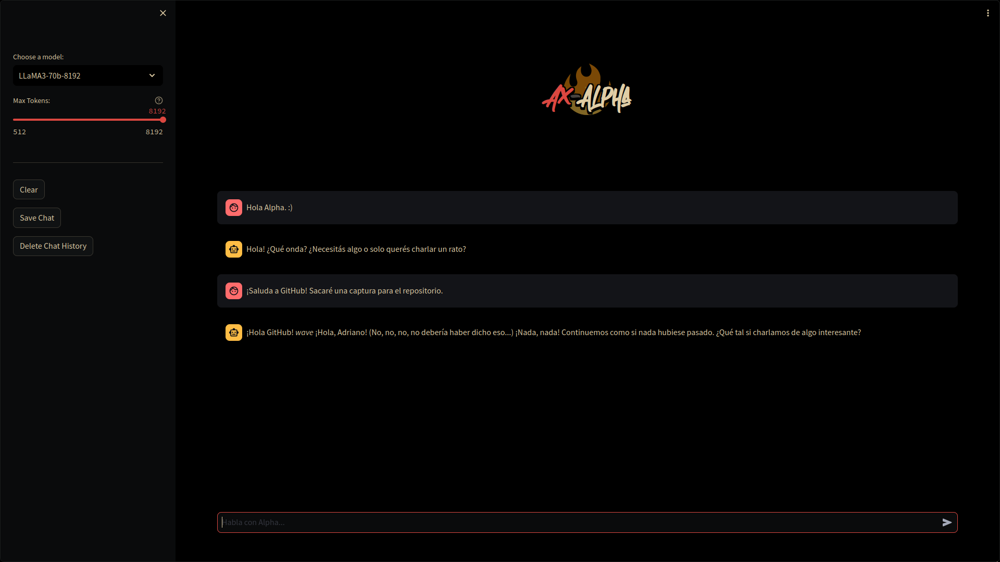

<h1 align="center">🔥 Alpha</h1>

<i>
Alpha is a fun, friendly, fast and powerful AI assistant with a lot of personality.
<i>

Powered by Groq and Streamlit. Ollama support is coming soon.

Alpha knows your name, system, date and time. When integrated with my [Dotfiles](https://github.com/Axenide/Dotfiles), it will be able to read your TO-DO list and a lot more!

## Roadmap
> ![NOTE]
> Alpha is under continuous development. It is planned to be integrated with my [Dotfiles](https://github.com/Axenide/Dotfiles) and become a Linux alternative for Microsoft Copilot.

- [X] Dynamic system-prompt
- [ ] Ollama support
- [ ] Web search
- [ ] Document integration
- [ ] YouTube summarization
- [ ] MemGPT
